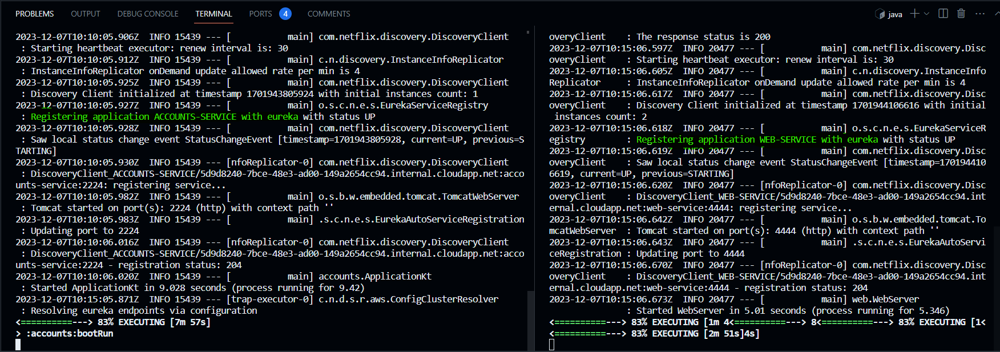
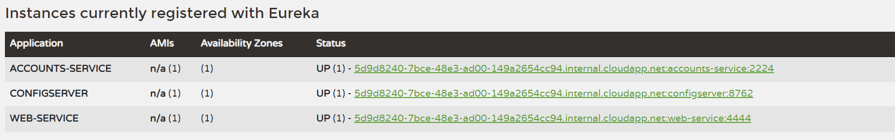
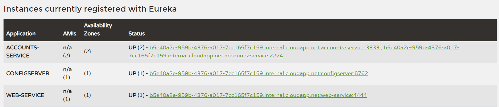
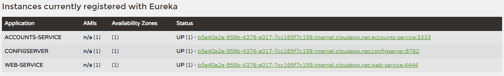
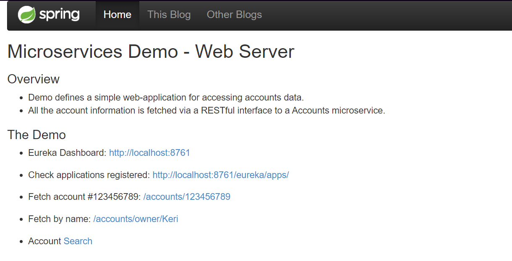
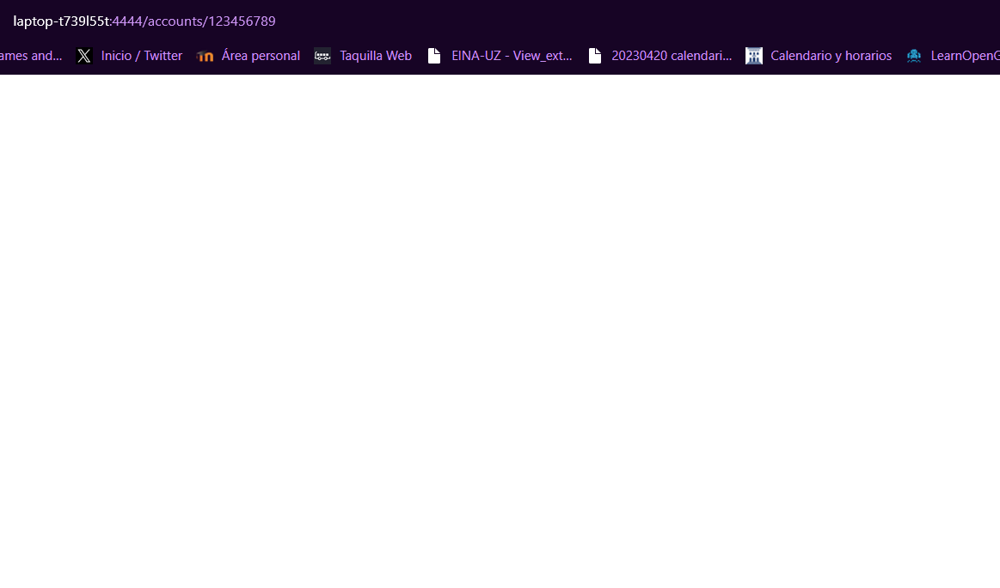
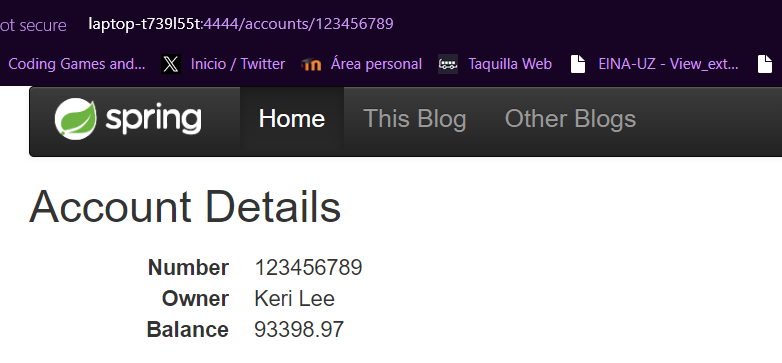

## Create your own configuration repository

The link to the repository is the following one:
<https://github.com/luciaarribas/lab6-microservices-config-repo>

The accounts services uses the port 2224 due to problems with the port 2222 in codespaces

## Accounts and Web services are running and registered

The following image shows a two log screenshot where the services are registered

And also, Eureka has this services registered

## Update the configuration repository
Now the accounts service uses the port 3333

<https://github.com/UNIZAR-30246-WebEngineering/lab6-microservices-config-repo/commit/f7f324d8683707c26346e18277153b777ad0570a>

## Running a second instance of accounts service

After running a second instance with the new configuration, we can observe that there are two 
accounts service instances registered in Eureka

As the image shows, there are two different instances of the accounts service, however Eureka detects it's the same service. This happens because both of them have the same name but different identifiers (name + port)

## Kill service accounts (2224)

After killing this service, it can be observed that Eureka has now registered only the accounts service at port 3333

Right after killing the accounts service and trying to make requests to the web, it does not give back 
the information about the accounts. This may be because the web service is still expecting the accounts
service to be at the 2224 port. 

If we try to fetch an account, for example, we can only see an empty page

However, after waiting for the web to realise the new port of the accounts service we can successfully
do requests to the web

